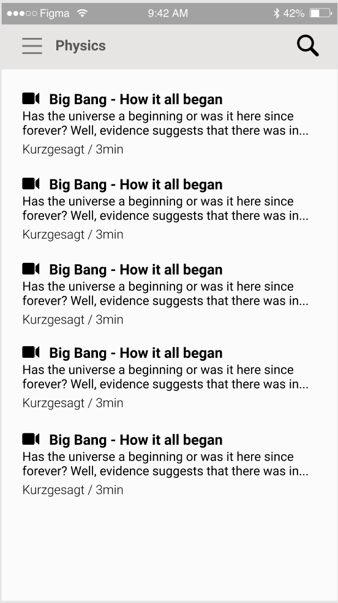

# Welcome to Atlas!

Atlas is an open-source project, we're working on opening the database to crowdsource content. The bot interface is not ideal for the time being, we'll need some help building a traditional (and much more user-friendly) list interface (mockup below) if anyone is up for it we're grateful for any help!

Contact me anytime: tom@immersive-g.com

  

We're under the MIT License, open-source codes of conduct apply.
